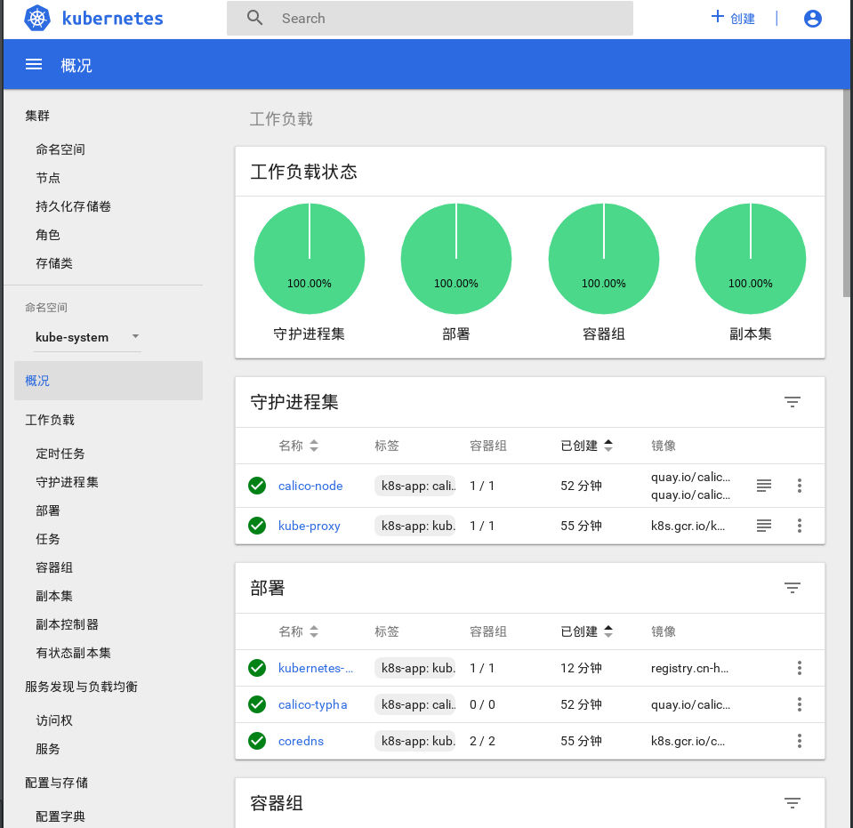

# Kubernetes需要安装的部件

## 步骤：
* 添加相应的源
* 下载docker&kubeadm & kubelet & Kubernetes-cni
* close swap
* 获取镜像列表，以便从国内获取
* 初始化环境
* 配置授权信息，以便可以便捷访问kube-apiserver
* 添加网络插件
* 单节点，设置master节点也可以运行pod(默认策略是master节点不运行)
* 部署其他插件

# 安装步骤

### 安装docker

* `docker`镜像加速，[登录](https://cr.console.aliyun.com/undefined/instances/mirrors?accounttraceid=db028d15-ed09-4c45-916a-632eddb1efcd)阿里开发者账户获取加速链接``

* `vim  /etc/docker/daemon.json` 写入以下内容
```
{
  "registry-mirrors": [
    "https://w1vzcb31.mirror.aliyuncs.com"
  ]
}
```
* 重启docker `sudo systemctl daemon-reload`, `sudo systemctl restart docker`

### 禁用swap

> 禁用swap的原因还在讨论中，[点击查看](https://github.com/kubernetes/kubernetes/issues/53533)

* 编辑`/etc/fstab`文件， 注释掉引用swap的行
* `sudo swapoff -a`
* 测试: 输入`top`， 若kib swap一行total显示0则关闭成功
```
永久关闭：
sudo gedit /etc/fstab
   注释掉swap那一行
   重启
```

## 安装`kubeadm, kubelet and kubectl`

* 所有操作的权限`root`
* 我们使用中科大的镜像源
* `apt-get update && apt-get install -y apt-transport-https curl`

> 这里会有一个错误的产生`gpg: no valid OpenPGP data found`解决办法

* `curl -O https://packages.cloud.google.com/apt/doc/apt-key.gpg `手动保存在目录下`apt-key.gpg` 
- 然后`apt-key add apt-ket.gpg`'

----

- 我们添加中科大的源
```
cat <<EOF > /etc/apt/sources.list.d/kubernetes.list
deb http://mirrors.ustc.edu.cn/kubernetes/apt kubernetes-xenial main
EOF

apt-get update
apt-get install -y kubelet kubeadm kubectl
apt-mark hold kubelet kubeadm kubectl
```

----

### 前置配置

- 查看Docker 使用cgroup driver
```
docker info | grep -i cgroup
--> Cgroup Driver: cgroupfs
```
- 但是kubelet 使用的`cgroupfs`为system,我们需要修改一下
- `gedit /etc/systemd/system/kubelet.service.d/10-kubeadm.conf` ADD 加上以下配置
> `Environment="KUBELET_CGROUP_ARGS=--cgroup-driver=cgroupfs"`

- 重启kubelet
```
systemctl daemon-reload
systemctl restart kubelet
```

- 解除防火墙
```
vim /etc/sysctl.conf

net.bridge.bridge-nf-call-ip6tables = 1
net.bridge.bridge-nf-call-iptables = 1
```
- 执行 `sysctl -p`

----

## 安装镜像

> master 和node 的核心服务如下
| Master节点 | Node节点 |
 |---| ---|
 | etcd-master | Control plane(如calico fannel) |
 | kube-apiserver | kube-proxy |
 | kube-controller-manager | other apps |
 | kube-dns ||
 | Control plane(如:calico,fannel) ||
 | kube-proxy ||
| kube-scheduler ||

- 使用以下命令获取我们安装的kubeadm的镜像版本 
- `kubeadm config images list`
```
实例：
k8s.gcr.io/kube-apiserver:v1.15.3
k8s.gcr.io/kube-controller-manager:v1.15.3
k8s.gcr.io/kube-scheduler:v1.15.3
k8s.gcr.io/kube-proxy:v1.15.3
k8s.gcr.io/pause:3.1
k8s.gcr.io/etcd:3.3.10
k8s.gcr.io/coredns:1.3.1
```
- 使用下面脚本下载镜像之后打包tar直接传服务器
```
#!/bin/bash
images=(
    kube-apiserver:v1.15.3
    kube-controller-manager:v1.15.3
    kube-scheduler:v1.15.3
    kube-proxy:v1.15.3
    pause:3.1
    etcd:3.3.10
    coredns:1.3.1
	
    pause:3.1

    kubernetes-dashboard-amd64:v1.10.0
    heapster-amd64:v1.5.4
    heapster-grafana-amd64:v5.0.4
    heapster-influxdb-amd64:v1.5.2
)

for imageName in ${images[@]} ; do
    docker pull registry.cn-hangzhou.aliyuncs.com/google_containers/$imageName
    docker tag registry.cn-hangzhou.aliyuncs.com/google_containers/$imageName k8s.gcr.io/$imageName
done
```

## 初始化 kubeadm

- `sudo kubeadm init --kubernetes-version=v1.15.3--apiserver-advertise-address=<ip> --pod-network-cidr=192.168.0.0/16`

- init 常用主要参数：
   - `--kubernetes-version`: 指定Kubenetes版本，如果不指定该参数，会从google网站下载最新的版本信息。
   - `--pod-network-cidr`: 指定pod网络的IP地址范围，它的值取决于你在下一步选择的哪个网络网络插件.
   - `--apiserver-advertise-address`: 指定master服务发布的Ip地址，如果不指定，则会自动检测网络接口，通常是内网IP。
   - `--feature-gates=CoreDNS`: 是否使用CoreDNS，值为true/false，CoreDNS插件在1.10中提升到了Beta阶段，最终会成为Kubernetes的缺省选项。

- 随后创建文件夹并拷贝配置文件
```
  mkdir -p $HOME/.kube
cp -i /etc/kubernetes/admin.conf $HOME/.kube/config
chown $(id -u):$(id -g) $HOME/.kube/config
```

- 测试 `curl https://127.0.0.1:6443 -k 或者 curl https://<master-ip>:6443 -k`
- 回应：
```
{
  "kind": "Status",
  "apiVersion": "v1",
  "metadata": {
    
  },
  "status": "Failure",
  "message": "forbidden: User \"system:anonymous\" cannot get path \"/\"",
  "reason": "Forbidden",
  "details": {
    
  },
  "code": 403
}
```
---

## 安装网络插件 - Calico

- 安装镜像[官方介绍](https://kubernetes.io/docs/setup/production-environment/tools/kubeadm/create-cluster-kubeadm/)：
```
docker pull quay.io/calico/node:v3.1.3
docker pull quay.io/calico/cni:v3.1.3
docker pull quay.io/calico/typha:v0.7.4

kubectl apply -f https://docs.projectcalico.org/v3.1/getting-started/kubernetes/installation/hosted/rbac-kdd.yaml
kubectl apply -f https://docs.projectcalico.org/v3.1/getting-started/kubernetes/installation/hosted/kubernetes-datastore/calico-networking/1.7/calico.yaml

```
> 为了Calico可以正常运行，必须在执行kubeadm init时使用`--pod-network-cidr=192.168.0.0/16`

- 检查 `kubectl get pods --all-namespace`
- 输出
```
NAMESPACE     NAME                                    READY   STATUS    RESTARTS   AGE
kube-system   calico-node-9njhr                       2/2     Running   0          148m
kube-system   coredns-5c98db65d4-pnh9s                1/1     Running   0          150m
kube-system   coredns-5c98db65d4-zr952                1/1     Running   0          150m
kube-system   etcd-debian                             1/1     Running   0          149m
kube-system   kube-apiserver-debian                   1/1     Running   0          150m
kube-system   kube-controller-manager-debian          1/1     Running   0          149m
kube-system   kube-proxy-qxhzx                        1/1     Running   0          150m
kube-system   kube-scheduler-debian                   1/1     Running   0          149m
kube-system   kubernetes-dashboard-86844cc55f-k7srl   1/1     Running   0          107m
```

## 加入其他节点


## 安装可视化Dashboard UI 
> [官网](https://github.com/kubernetes/dashboard/wiki)

- 简介： 在 Kubernetes 社区中，有一个很受欢迎的 Dashboard 项目，它可以给用户提供一个可视化的 Web 界面来查看当前集群的各种信息。用户可以用 Kubernetes Dashboard 部署容器化的应用、监控应用的状态、执行故障排查任务以及管理 Kubernetes 各种资源。


- 由于yaml文件配置是从google中pull镜像我们下载yaml文件到本地修改仓库

- ` wget https://raw.githubusercontent.com/kubernetes/dashboard/v1.10.1/src/deploy/recommended/kubernetes-dashboard.yaml
`
- 修改yaml配置文件中`image`部分，指定从阿里垃圾镜像
```
containers:
      - name: kubernetes-dashboard
        image: registry.cn-hangzhou.aliyuncs.com/google_containers/kubernetes-dashboard-amd64:v1.10.1
        ports:
        - containerPort: 8443
          protocol: TCP
```

- 然后执行以下命令部署dashboard服务：`kubectl create -f kubernetes-dashboard.yaml`

- 查询pod状态为running说明部署成功
- `kubectl get pod --namespace=kube-system -o wide | grep dashboard`

---

###  访问dashboard
[官方参考](https://kubernetes.io/docs/tasks/access-application-cluster/web-ui-dashboard/#accessing-the-dashboard-ui)

#### 有以下几种方式访问dashboard：

- Nodport方式访问dashboard，service类型改为NodePort
- loadbalacer方式，service类型改为loadbalacer
- Ingress方式访问dashboard
- API server方式访问 dashboard
- kubectl proxy方式访问dashboard

### NodePort方式

- 为了便于本地访问，修改yaml文件，将service改为NodePort 类型：

```
kind: Service
apiVersion: v1
metadata:
  labels:
    k8s-app: kubernetes-dashboard
  name: kubernetes-dashboard
  namespace: kube-system
spec:
  type: NodePort       #增加type: NodePort
  ports:
    - port: 443
      targetPort: 8443
      nodePort: 31620  #增加nodePort: 31620
  selector:
    k8s-app: kubernetes-dashboard
```

- 重新应用yaml文件`kubectl apply -f kubernetes-dashboard.yaml`
- 查看service，TYPE类型已经变为NodePort，端口为31620
- `kubectl get service -n kube-system | grep dashboard`
- 浏览器访问`https://192.168.9.19:31620`
- dashboard支持kubeconfig和token登录

### 创建登录用户
[官方参考](https://github.com/kubernetes/dashboard/wiki/Creating-sample-user)

- 创建`kubernetes-dashboard-admin.yaml`文件
```
apiVersion: v1
kind: ServiceAccount
metadata:
  name: admin-user
  namespace: kube-system
---
# Create ClusterRoleBinding
apiVersion: rbac.authorization.k8s.io/v1
kind: ClusterRoleBinding
metadata:
  name: admin-user
roleRef:
  apiGroup: rbac.authorization.k8s.io
  kind: ClusterRole
  name: cluster-admin
subjects:
- kind: ServiceAccount
  name: admin-user
  namespace: kube-system
```

- 执行yaml文件：`kubectl create -f dashboard-adminuser.yaml`

- 解释： 上面创建了一个叫admin-user的服务帐号，并放在kube-system命名空间下，并将cluster-admin角色绑定到了admin-user账户，这样admin-user就有了管理员的权限，默认情况下,kubeadm创建集群时已经创建了cluster-admin角色，我们直接绑定就行
- 查看admin-user账户的token`kubectl -n kube-system describe secret $(kubectl -n kube-system get secret | grep admin-user | awk '{print $1}')`

---

### loadbalacer方式

- 修改 `kubernetes-dashboard.yaml`
```
---
# ------------------- Dashboard Service ------------------- #

kind: Service
apiVersion: v1
metadata:
  labels:
    k8s-app: kubernetes-dashboard
  name: kubernetes-dashboard
  namespace: kube-system
spec:
  type: LoadBalancer
  ports:
    - port: 443
      targetPort: 8443
  selector:
    k8s-app: kubernetes-dashboard
```

- 重新应用yaml文件`kubectl apply -f kubernetes-dashboard.yaml --force`

- `注意由nodeport改为其他类型需要添加–forece才能执行成功。`

---

### nginx-ingress方式

- 部署nginx-ingress-controller
 [官方1](https://github.com/kubernetes/ingress-nginx)[官方2](https://kubernetes.github.io/ingress-nginx/)

-  下载nginx-ingress-controller配置文件
 `wget https://raw.githubusercontent.com/kubernetes/ingress-nginx/nginx-0.21.0/deploy/mandatory.yaml`

- 修改镜像路径
 ```
 替换镜像路径
  image: willdockerhub/nginx-ingress-controller:0.21.0
  ```

- 执行yaml部署 ` kubectl apply -f mandatory.yaml  `

- nodeport方式对外提供服务：
 > 通过ingress-controller对外提供服务，现在还需要手动给ingress-controller建立一个servcie，接收集群外部流量。
- service-nodeport配置文件：`wget https://raw.githubusercontent.com/kubernetes/ingress-nginx/master/deploy/provider/baremetal/service-nodeport.yaml`

- 执行yaml`kubectk apply -f service-nodeport.yaml`
-  查看ingress-nginx组件状态`kubectl get pod -n ingress-nginx `, `kubectl get svc -n ingress-nginx `
- 查看创建的ingress service暴露的端口：`kubectl get svc -n ingress-nginx `

### 创建ingress-nginx后端服务
- 创建一个Service及后端Deployment(以nginx为例)
```
apiVersion: v1
kind: Service
metadata:
  name: myapp
  namespace: default
spec:
  selector:
    app: myapp
    release: canary
  ports:
  - name: http
    port: 80
    targetPort: 80
---
apiVersion: apps/v1
kind: Deployment
metadata:
  name: myapp-deploy
spec:
  replicas: 2
  selector:
    matchLabels:
      app: myapp
      release: canary
  template:
    metadata:
      labels:
        app: myapp
        release: canary
    spec:
      containers:
      - name: myapp
        image: ikubernetes/myapp:v2
        ports:
        - name: httpd
          containerPort: 80
```
- 创建相关服务及检查状态是否就绪 `kubectl apply -f deploy-demon.yaml `
- `kubectl get pods`

- 创建myapp的ingress规则
```
apiVersion: extensions/v1beta1
kind: Ingress
metadata:
  name: ingress-myapp
  namespace: default
  annotations:
    kubernets.io/ingress.class: "nginx"
spec:
  rules:
  - host: myapp.magedu.com
    http:
      paths:
      - path:
        backend:
          serviceName: myapp
          servicePort: 80
```

- 查看创建的ingress规则`kubectl apply -f ingress-myapp.yaml ` , `kubectl get ingress`

- 查看ingress-default-backend的详细信息：` kubectl exec -n ingress-nginx -ti nginx-ingress-controller-6bdcbbdfdc-wd2bn `
```
cat nginx.conf
...... 
       ## start server myapp.magedu.com
        server {
                server_name myapp.magedu.com ;

                listen 80;

                set $proxy_upstream_name "-";

                location / {

                        set $namespace      "default";
                        set $ingress_name   "ingress-myapp";
                        set $service_name   "myapp";
                        set $service_port   "80";
                        set $location_path  "/";
```
- 配置集群外域名解析 /etc/hosts文件
```
xxx.xxx.xxx baidu.com
```

## NodePort方式
- 修改nginx-ingress-controller配置文件mandatory.yaml，删除containers.ports部分做的主机端口映射，hostPort: 80和 hostPort: 443
- 并为nginx-ingress-controller创建NodePort类型的service,通过nodeip+port方式对外提供服务：
```
wget https://raw.githubusercontent.com/kubernetes/ingress-nginx/master/deploy/provider/baremetal/service-nodeport.yaml

kubectl apply -f service-nodeport.yaml
```
- 直接执行yaml文件即可，可以看到创建了nginx-ingress-controller的NodePort类型service` kubectl get service -n ingress-nginx `
- 集群外主机hosts配置文件不变
- 选择token方式，通过域名+port方式访问

## loadbalancer方式
[首先需要部署loadbalancer，参考这里](https://blog.csdn.net/networken/article/details/85928369)
- 然后修改nginx ingress controller的service类型为type: LoadBalancer即可：
```
vim service-nodeport.yaml
---
apiVersion: v1
kind: Service
metadata:
  name: ingress-nginx
  namespace: ingress-nginx
  labels:
    app.kubernetes.io/name: ingress-nginx
    app.kubernetes.io/part-of: ingress-nginx
spec:
  type: LoadBalancer
  ports:
    - name: http
      port: 80
      targetPort: 80
      protocol: TCP
    - name: https
      port: 443
      targetPort: 443
      protocol: TCP
  selector:
    app.kubernetes.io/name: ingress-nginx
    app.kubernetes.io/part-of: ingress-nginx
```
- 更新yaml文件`kubectl apply -f service-nodeport.yaml --force`
- 查看service 类型以及获取到的EXTERNAL-IP `kubectl get svc -n ingress-nginx `
-修改集群外主机hosts配置文件

## API Server方式
- 如果Kubernetes API服务器是公开的，并可以从外部访问，那我们可以直接使用API Server
- Dashboard的访问地址为：`https://<master-ip>:<apiserver-port>/api/v1/namespaces/kube-system/services/https:kubernetes-dashboard:/proxy/`
- 但是浏览器返回的结果可能如下：
```
{
  "kind": "Status",
  "apiVersion": "v1",
  "metadata": {
    
  },
  "status": "Failure",
  "message": "services \"https:kubernetes-dashboard:\" is forbidden: User \"system:anonymous\" cannot get resource \"services/proxy\" in API group \"\" in the namespace \"kube-system\"",
  "reason": "Forbidden",
  "details": {
    "name": "https:kubernetes-dashboard:",
    "kind": "services"
  },
  "code": 403
}
```
- 这是因为最新版的k8s默认启用了RBAC，并为未认证用户赋予了一个默认的身份：anonymous。
- 对于API Server来说，它是使用证书进行认证的，我们需要先创建一个证书：
- 我们使用client-certificate-data和client-key-data生成一个p12文件，可使用下列命令：
```
# 生成client-certificate-data
grep 'client-certificate-data' ~/.kube/config | head -n 1 | awk '{print $2}' | base64 -d >> kubecfg.crt
# 生成client-key-data
grep 'client-key-data' ~/.kube/config | head -n 1 | awk '{print $2}' | base64 -d >> kubecfg.key
# 生成p12
openssl pkcs12 -export -clcerts -inkey kubecfg.key -in kubecfg.crt -out kubecfg.p12 -name "kubernetes-client"
```

## Porxy方式
- 如果要在本地访问dashboard，可运行如下命令：
`kubectl proxy`

- 现在就可以通过以下链接来访问Dashborad UI
`http://localhost:8001/api/v1/namespaces/kube-system/services/https:kubernetes-dashboard:/proxy/`
- 这种方式默认情况下，只能从本地访问（启动它的机器）。
- 我们也可以使用–address和–accept-hosts参数来允许外部访问：
`kubectl proxy --address='0.0.0.0'  --accept-hosts='^*$'`
- 然后我们在外网访问以下链接：
`http://<master-ip>:8001/api/v1/namespaces/kube-system/services/https:kubernetes-dashboard:/proxy/`

# k8s监控集成heapster
- 还在查看文档中，遇到的问题是heapster链接不上api-server
- 资料说明是heapster的用户权限不到需要绑定用户权限
```
apiVersion: rbac.authorization.k8s.io/v1beta1
kind: ClusterRoleBinding
metadata:
  name: heapster
roleRef:
  apiGroup: rbac.authorization.k8s.io
  kind: ClusterRole
  name: cluster-admin
subjects:
- kind: ServiceAccount
  name: heapster
  namespace: kube-system
```
- 使用这个链接成功了之后`grafana`控制面板得不到数据，继续查找资料中
